<!-- ⛓️ Azazel7 · danakotech -->
<p align="center">
  
</p>

<p align="center">
  
</p>

<p align="center">
  
  
  
</p>

---

## 👨‍💻 `$ whoami`

```yaml
alias:     Danako · Azazel7
role:      Cybersecurity enthusiast · Bitcoin & blockchain builder
mission:   Exploring the intersection of privacy, security and decentralized tech
believes:  "Confidentiality is freedom. Code is law. Bitcoin is the future."
status:    🟢 running a node · verifying, not trusting
```

## ⚡ Tech Interests

| 🛡️ **Cybersecurity** | ₿ **Bitcoin** |
|:--|:--|
| Ethical hacking, pentesting & threat analysis | Bitcoin Core & the Lightning Network |
| **⛓️ Blockchain** | **🔐 Privacy** |
| Smart contracts & decentralized applications | Encryption & Zero-Knowledge Proofs |

## 🧰 Toolbox

<p align="center">
  
  
  
  
  
  
  
  
</p>

## 🌐 Connect with Me

<p align="center">
  <a href="https://github.com/danakotech"></a>
  <a href="mailto:admin@sedebitcoin.com"></a>
  <!-- Optional: <a href="https://njump.me/npub..."></a> -->
</p>

---

<p align="center"><sub>⛏️ Block by block · 🔐 Encrypt everything · ₿ Stay humble, stack sats</sub></p>
